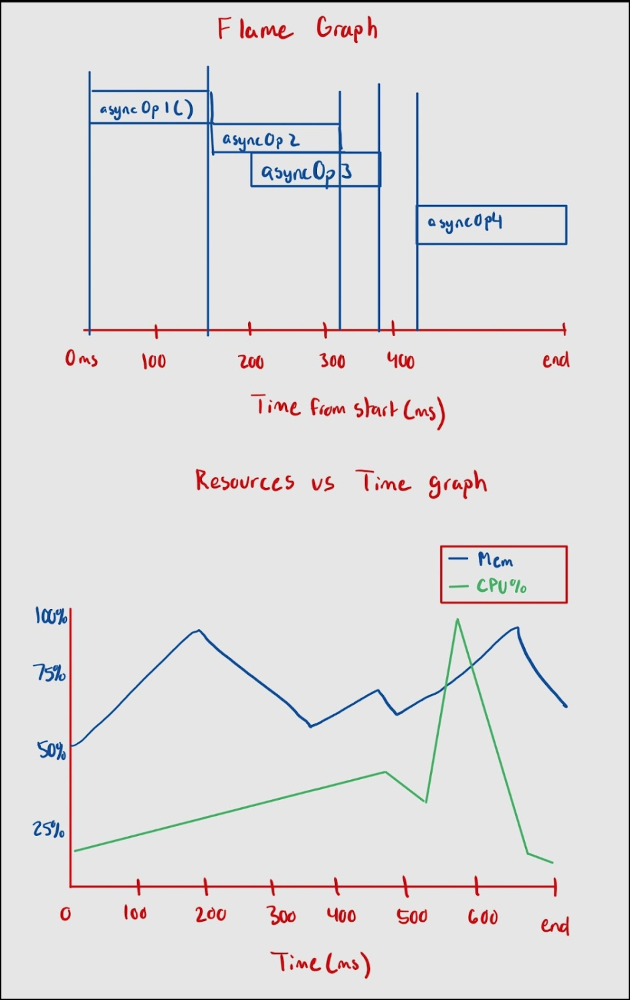

Use this file to commit information clearly documenting your check-ins' content. If you want to store more information/details besides what's required for the check-ins that's fine too. Make sure that your TA has had a chance to sign off on your check-in each week (before the deadline); typically you should discuss your material with them before finalizing it here.

# Check-in 1

## Ideas:
- Taint-checking - check all variables that contain user-inputed data (tainted data) and prevent those variables from being used until they’ve been sanitized; prevents SQL injections
    - Which language?
    - Is this trivial?
    - Stack check, real language
- Memory leaks
  - C++/C
  - Static check required
- Check how long asynchronous operations take
  - JS/Java
  - Static check impossible
  - Visualization would be easy/a lot of options
- Type checker
  - Typed language would be easier since static checks
- Profiler
  - Runtime Speed for each portion of the code, (Optional: memory, CPU usage)
  - Optional: support 2 languages and allow comparison (since it is dynamic-only, shouldn’t be hard)
  - No need for static checking
  - Needs visualization
- Potential index-out-of-bound detector
  - Can have static checking if index values are static
- Detect coupling between classes
  - Static check, visualization
  - Suggest refactoring? 
Debugger for extremely obscure language

## Follow up plans for next week:
- Pick project idea 
- Pick what language we’d want to analyze
- Decide what the visualization would look like
- Create timeline
- Assign roles

## TA Feedback
- Can prove a property about a program
  - Ex: type checker - Prove that types are correct
- Or reason about the execution of a program
  - Tells you properties of a program
  - Ex: how fast it runs, which parts take more time than others, etc.
- We should pick some property we want to look at
  - Ex: check if doing extra memory allocations
- 3 main things to think about
  - Static analysis
  - Work on existing language
  - visualization component
- Expecting us to do at least 2 of the 3 things
- Heavily discouraged to do ONLY 1 and 3
- Should change the outputs depending on the control flow of the program
  - Ex: If building a type checker, if there’s an if statement, it should depend on the control flow


***
# Check-in 2

## Finalized Project Idea

We decided on a combination of Profiler and Async Idea.
- **Features**
  1. Check how long async operations take
     - Analyze Node.js event loop/queues
     - Find out which tasks were active when and when callbacks were executed
  2. Track time taken for each portion of the code
     - Frequency and duration of functions/methods
     - Can go even deeper and look at if statements or loops which will only track information about the path the execution takes (flow sensitive)
  3. Track memory and CPU usage
- **Visualizations**
  - Resources vs Time graph
    - Give more precise measurements when hovering over points on the graph
  - Call graph
    - Display % of program execution time
    - For async tasks, can display time taken for each event
  - Highlighting code (TBD after discussion with TA)

## Languages
- Profiler in JavaScript
- Analyzed Language also JavaScript

## Libraries
We will most likely utilize the following libraries:
- [Babel Parser (supports TypeScript)](https://babeljs.io/docs/babel-parser)
- [Acorn JS](https://github.com/acornjs/acorn)

## Project Components and Assigned Users (SUBJECT TO CHANGE)
- Converting Input Source Code to AST using a library - **Sarah**
- Finding the interest points for instrumentation - **Angus**
  - Need to decide what makes a point interesting
- Measure time and resources at those points and store somewhere - **Payam**
- Visualizations - **Elias, Sean**
  - Build a GUI for Visualization in Electron
  - Resources vs Time Graph
  - Call Graph

## Follow-up Tasks
- Decide the interest points for instrumentation
- Check if existing graphs are enough for visualization. If not, add "code highlighting".

## Timeline
<table>
  <thead>
    <tr>
      <th>Checkpoint</th>
      <th>Deliverables</th>
    </tr>
  </thead>
  <tbody>
    <tr>
      <td>Check-In 3 (Week 10) - March 15th</td>
      <td>
        <ul>
          <li>Create project mockup (including visualization)</li>
          <li>Find interest points for instrumentation</li>
          <li>Start setting up the visualization</li>
          <li>Conduct first user study and incorporate any feedback</li>
        </ul>
      </td>
    </tr>
    <tr>
      <td>Check-In 4 (Week 11) - March 22nd</td>
      <td>
        <ul>
          <li>Get conversion of input code to AST working</li>
          <li>Measure time and resources at interest points and store somewhere</li>
          <li>Read the measured data and visualize the statistics</li>
        </ul>
      </td>
    </tr>
    <tr>
      <td>Check-In 5 (Week 12) - March 29th</td>
      <td>
        <ul>
          <li>Conduct final user study and incorporate any feedback</li>
          <li>Debug</li>
          <li>Create video</li>
        </ul>
      </td>
    </tr>
    <tr>
      <td>Due date - April 8th</td>
      <td>Reserve time</td>
    </tr>
  </tbody>
</table>

## TA Feedback - March 4th

- For dynamic checking programs - the visualization component needs to be substantial enough for 2 people to work on for 1 month
- Profiler idea
  - Need more than just showing some results in a graph
  - Need more analysis, insights
  - OR, some more interaction in an interface
    - Ex: interface shows data, allows user to pick data they’re more interested in and present it in another view, etc.
  - Some examples of better insight
    - Averaging isn’t complex enough because there are differences between functions and our goal is to provide insights for specific parts of the code
- Async idea (pretty similar to synchronous profiler)
  - Could focus on properties that are only in async operations
    - Ex: Analyze Node.js event loop, queues
    - Could provide more details on what the loop is doing
- Static check problems
  - Sometimes a static check tool can’t prove the property, for an arbitrary piece of code
  - We’d need to decide on a subset of the language (but needs to be enough to be complex)
  - Analysis might not end up being complex enough
    - Ex: index out of bounds detector
      - Would be too simple if we just limit it to statically known indices
      - If we try to expand to dynamic arrays, the analysis gets really complex
  - Coupling between classes
    - Fairly open-ended, would need to define more things
  - Linter?
    - Depends on what it does
    - Needs to be flow sensitive
  - Litmus test for static check problems
    - Is the analysis local? If so, it’s not complex enough
      - Ex: linter adding semicolons in a statement is not flow sensitive

***
# Check-in 3

## Project Mockup

User writes async code that they want to analyze. They run our tool and pass in the source code file path, which opens up an Electron UI app and then runs the code. Once the code has ran, we display metrics and insights such as the following:

- **Flame graph**
  - X-axis: running time of the program
  - Y-axis: async operations
    - Each async operation has its own row that shows:
      - Stack trace/line of code it represents
      - Bar for a given async function is made up of two colors: one for when it is idling (in the queue) and the other when code is being executed.
      - SORT OF like this: [clinicjs.org/flame/](https://clinicjs.org/flame/)
    - Clicking into the async op should show the user the specific piece of code
  - Below this graph, we would show the state of the event queue
- **Resources vs Time graph**
  - Resources being CPU % and RAM %
  - Maybe: Show this specifically for async operations



## User Study

Planning to conduct this on the weekend. We have created some basic mockups and questions to ask the users

**Biography:**
- How old are you?
- Have you used JavaScript before?
- Have you ever done any asynchronous programming?
- From a scale of 1-10 rate your understanding of how asynchronous code works in JavaScript?

**Reading the code:**
(Now pass the code example to the user. Give them enough time to read and understand the code.)
- Did you fully understand the functionality of the provided code?
- How much time do you expect each async function in the code will use?
- How much CPU/memory resource do you expect each async function in the code will use?

**Visualization:**
(Now pass the visualization example to the user. Give them enough time to understand the graphs.)
- How long did it take you to understand the relation between pieces of the graph and code?
- By looking at the profiler, did you learn anything new about the code performance which you didn’t expect when inspecting the code?
- In terms of usefulness, give a score of 1-10 for each part of the visualization:
- In terms of intuitiveness, give a score of 1-10 for each part of the visualization:
- What other pieces of info do you think would have been useful in the visualization graph?
- Finally, from a scale of 1-10 how would you overall rate the profiler?

## TA Feedback - March 11th

- We should do something with control flow info
  - Using it in our analysis
- For async project there's a use case
- Node JS - single threaded
  - Time taken on async function will depend on what’s inside the queue already
  - Could reveal things like
    - Function takes a long time, but it’s not the function’s fault because there was stuff filling up the queue
- Question: To be flow-sensitive, how do we track execution in other branches?
  - Symbolic execution
    - At every branch, record the branch that was taken and the condition that was evaluated
    - See what you would need to go to the other branch
  - We probably don’t need to do this for async stuff
- Aim to do user study by end of this week, but that’s not a hard deadline.
- For memory and CPU usage - that can be done easily if targeting Linux?
- Call graph is great, but ideally think about user would do with it.
  - Our visualization should help the user figure out how they can deal with async calls that take too long
  - See which functions end up with having a lot of tasks in the queue
  - Point the user to where the problem is - this would be rich
  - If we have a call graph, that would only be the first step of the debugging process
    - We need to provide more functionality for the user to figure out where in the call graph to look for problematic functions (or async tasks)
- How should we highlight source code?
  - Our analysis should tell us a certain piece of code is problematic
  - Or visualization would just highlight that piece
  - Could build this as IDE extension if desired, but plugin could do too much so be careful
- Microservices - use case for our tool
  - Divide code up into different modules that communicate via network calls instead of function calls
  - Our tool would be useful for analyzing problems with microservices
    - Because of the number of IO operations between different modules


***
# Check-in 4
## Results of the first user study

We performed the user study on 2 users. We provided a piece of async code and asked them to estimate order of operations,
time taken, CPU and Memory usage for that code. Then, we show a screenshot of our visualization to the user and ask them
to understand it and give feedback about the information provided.

**Summary of User 1 feedback:**
- The user has prior experience writing async code in JavaScript and rated themselves 6/10 in this regard.
- Estimation of the operation order: Correct
- Estimation of time: Indecisive
- Estimation of CPU/memory utilization: Indecisive
- How long to understand the graphs: 1min
- Learned anything new after seeing the graphs:
  - That the waiting times and executing times look like they can be quite different is interesting.
- Average usefulness of different parts: 9/10
- Average intuitiveness of different parts: 9/10
- Other pieces to include (suggestion from user):
  - What the variables were at the different execution steps in the flame graph
  - Combine the resources graph with the flame graph might be useful in debugging what executing functions might be causing high resource usage
- Overall score: 9/10

**Summary of User 2 feedback:**
- The user has prior experience writing JavaScript but not much with async code. They rated themselves 2/10 in this regard.
- Estimation of the operation order: Correct
- Estimation of time: Correct
- Estimation of CPU/memory utilization: Almost correct
- How long to understand the graphs: 1min
- Learned anything new after seeing the graphs:
  - The read file is longer than my estimate
- Average usefulness of different parts: 7/10
- Average intuitiveness of different parts: 8/10
- Other pieces to include (suggestion from user):
  - [Did not have any suggestion]
- Overall score: 7/10

## Project re-design explanation

This week, we decided to re-design our project to make it more well-defined. We clarified what problems our project is
intended to solve, how we plan on identifying them, how we plan on solving them, and who is in charge of each component
involved.

### Motivating Example:
```javascript
async function removePost(userId, postId) {
const permissions = await fetchPermissions(userId);
const post = await fetchPost(postId);

if(permissions.can('remove post') === false) {
  throw new Error('Not enough permissions!');
}

await sendRemoveRequest(post);
}
```
In this example, the code wouldn't be efficient as we're waiting for fetchPermissions() to return before calling
fetchPost(). Additionally, checking for permissions is waiting for fetchPost() to return even though they don't depend
on each other.

We could write it like this:
```javascript
async function removePost(userId, postId) {
  const permissions = await fetchPermissions(userId);
  
  if(permissions.can('remove post') === false) {
    throw new Error('Not enough permissions!');
  }
  const post = await fetchPost(postId);
  await sendRemoveRequest(post);
}

```
This example also wouldn't be efficient as we could have been fetching post while we were checking the permissions.

Ideally, the code would look like this as permissions and post are being fetched in parallel:
```javascript
async function removePost(userId, postId) {
  const permissionsPromise = fetchPermissions(userId);
  const postPromise = fetchPost(postId);
  
  if((await permissionsPromise).can('remove post') === false) {
    throw new Error('Not enough permissions!');
  }
  
  const post = await postPromise;
  await sendRemoveRequest(post);
}
```
### What problem are we trying to solve? Be specific:
We are trying to identify code that waits on an asynchronous operation, but that could be called in a different manner
which allows the code to execute earlier. Specifically, things like:
- Serial Await calls
- Chained promises that do not depend on one another
- Code within callbacks that does not depend on the async operation. (e.g. independent code in a Promise.then() call)

### How do we know when a problem exists? What components are needed to diagnose problems?
- We’d need to look at variables that depend on async calls and other lines of code that interact with it.
- Create a list of all of the async calls, Create a dependency data structure that shows which asynchronous calls use the output of which other asynchronous calls.
- Need to perform the analysis on different types of asynchronous methods/syntaxes:
  - “Standard” callbacks
  - Promise chaining
  - Async/await

### How do we solve this problem? What components are needed for solve the problem?
Our tool would take the identified problem as inputs, and create suggestions based on the problem type:
- For standard callbacks:
  - Suggest positioning the independent code outside of the callback. Offer insight on where the code could be relocated (i.e. after a certain line number)
- For promise chaining:
  - If the independent code is an async operation itself, suggest taking it out of the chain as its own Promise variable. If it isn’t, suggest cutting and pasting the code to after the chain.
- For async/await:
  - Suggest removing the unnecessary await calls.
- The suggestions would be outputted to the command line.
- If the above is insufficient for project scope, we can add a visualization that highlights code that doesn’t depend on async calls?

### Components:
- Intake JavaScript source code and create AST using API.
- Parse the AST and define which lines of code are dependent on another, construct a mapping of them.
- For each line of code determine if it is called asynchronously. If so, using the dependency map, determine whether it is dependent on any other code within a previously connected async operation. If not, identify as a problem.
- Given the problem line of code, the snippet it's within, and the type of problem as input, make a suggestion on how to fix it.

### Who is responsible for writing each component?

- AST and Dependency Mapping (1 person) - Payam
- Problem Diagnosis (2 people) - Elias and Sean
- Solution (2 people) - Angus and Sarah

## Status of implementation so far

Clarified what our project is going to do, what components need to be made, and assigned roles for each component.

## Plans for final user study

Since the scope of our project has changed to more of a static analysis of async code, our final user study will focus
more on that. We’ll show users an example piece of code of a program with inefficient async use and ask them to track
the control flow of the program. We’ll then ask them if they think there are any areas of improvement to reduce the
overall runtime of the program. We’ll then show them what our program will do and compare their answers to our program
analysis and ask them for any feedback.

## Planned timeline for the remaining days

<table>
  <tr>
    <th>Checkpoint</th>
    <th>Deliverables</th>
  </tr>
  <tr>
    <td>
      By Check-In 5 <br />
      March 22 - March 29th
    </td>
    <td>
      <ul>
        <li>Have program running</li>
        <li>Conduct final user study</li>
      </ul>
    </td>
  </tr>
  <tr>
    <td>March 29th - April 5th</td>
    <td>
      <ul>
        <li>Incorporate final user study feedback</li>
        <li>Debug</li>
        <li>All code should be committed by Apr 5th.</li>
      </ul>
    </td>
  </tr>
  <tr>
    <td>
      By due date <br />
      April 5th - April 8th
    </td>
    <td>
      Make video
    </td>
  </tr>
</table>

## TA Feedback - March 18th
- Sounds like our visualization can be done just by taking a snapshot of the queue
  - This doesn’t involve enough analysis / is not flow sensitive, because we’re just plotting the queue data
  - Would be more interesting to map the functions that called them
  - If we have a gap where no async functions are running, can we show why?
  - Or figure out why there are so many functions on the queue at a given time
    - This is an example of the analysis to perform
- For the flame graph, we only need the data of the current function (isn’t flow sensitive)
  - We’d just be sampling what’s running, when an event on the queue happens
  - We also need to take into account what happens before the function
    - The tool needs to do something different based on what happened before
  - For async functions, we should think about:
    - Why is this async function taking so much time?
    - Why are there so many async ops on the queue at this given time?
    - What other tasks are they blocked on?
- Node JS - we won’t have stuff running parallel, since it’s single threaded
  - At the C level, the socket/networking is done in parallel, but not when C sends the data back to Node
    - C will push something inside the Node.js queue, which is single threaded.

***
# Check-in 5

## Final User Study Feedback

**User 1**
- Previous experience with JavaScript (JS), somewhat familiar with asynchronous JS code.
- Identified main bottleneck in the program but missed a smaller piece where a statement didn’t depend on an async operation.
- Believes the tool would be helpful because it’s easy to forget about optimization.
- Suggests that newcomers to JS might not know to use Promise.all() or understand its function.

**User 2**
- Previous experience with JavaScript, vaguely understands asynchronous JS code.
- Identified that three fetch calls were being called sequentially even though they didn’t depend on each other, but missed out on code that was blocked from an async function despite not needing to wait for it.
- Finds the idea interesting and potentially very helpful.
- Suggests that feedback should be clear with suggestions, akin to ChatGPT responses.

## Project Implementation Status

We've implemented the AST parser and agreed on a dependency mapping for analysis. The problem diagnosis team can use this mapping to program in parallel. We still need to decide how to provide feedback; depending on time constraints, we may opt for simple feedback such as pointing out problematic lines. We're considering using the combination of AST and dependency map to identify and pass problematic line numbers to the solving function.

## Plans for Final Video

- Writing script: Whoever finishes their work first.
- Editing: Elias

## Remaining Timeline

- Complete individual implementation by Monday, April 1st.
- Combine work by April 5th.
- Create video by April 7th.

## TA Feedback - March 25th

- Precision not expected to be 100%; need to specify supported control flow patterns.
- Syntactic patterns alone aren't flow-sensitive.
- Dependency graph analysis should be precise, considering all paths.
- Precise definition needed for dependency relationships.
- Feedback to users should focus on specific classes of problems.
- Output error line(s) on the command line; choice between outputting errors individually or all at once is flexible.
